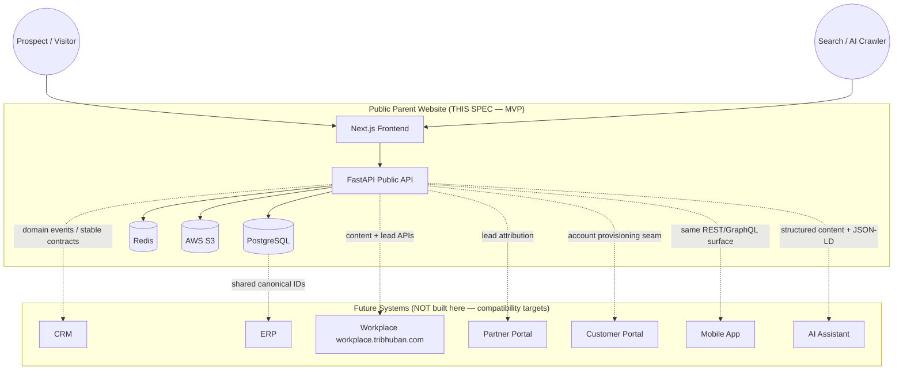
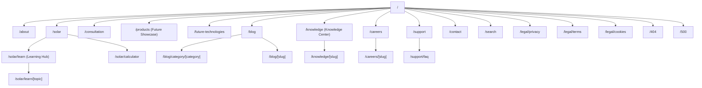
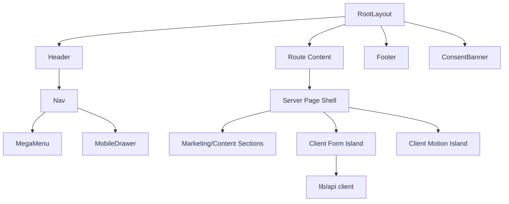
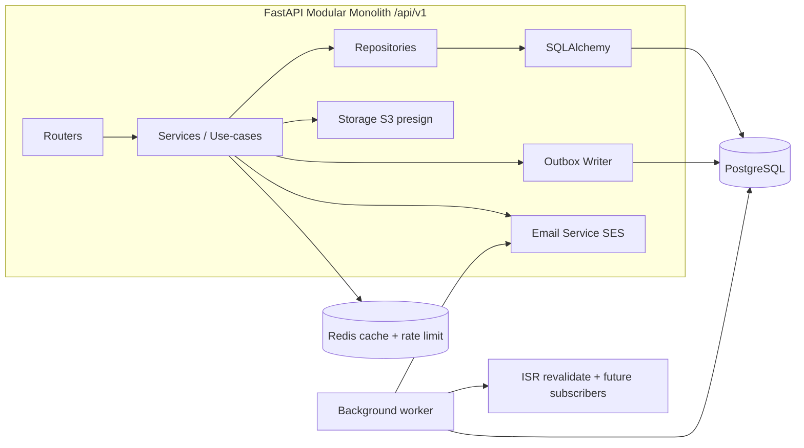
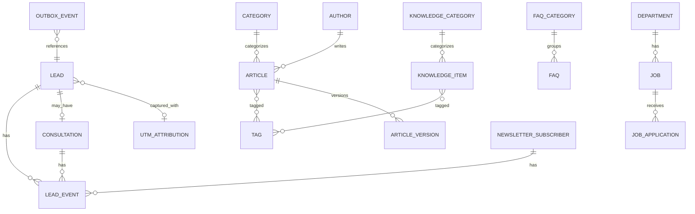
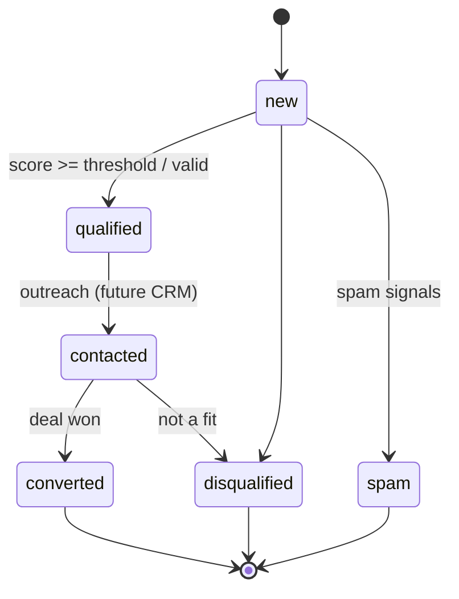

# Design Document: Tribhuban Parent Website (Public Digital Headquarters)

## Document Control

| Field | Value |
|-------|-------|
| Product | Tribhuban Concepts — Parent Website (Public) |
| Scope | Public-facing marketing, education, lead generation, and content platform (MVP) |
| Explicitly Out of Scope | Workplace, CRM, HRMS, ERP, Partner Dashboard, Customer Dashboard, internal auth |
| Design Detail Level | High-Level (architecture, diagrams, data models) **and** Low-Level (code, algorithms, function signatures) |
| Frontend Language | TypeScript (Next.js App Router) |
| Backend Language | Python (FastAPI) |
| Status | Draft for architecture review |

> **Reading guide.** This is an Engineering Design Document (EDD). Requirements will be derived from it afterward. Every significant decision states a **Rationale**, **Trade-offs**, and where relevant a **Scalability note**. Assumptions are called out explicitly as `ASSUMPTION:` and never left silent. Scope tiers are tagged **[MVP]**, **[Post-MVP]**, **[Vision]**.

---

## Overview

Tribhuban Concepts is an Indian technology and engineering company whose brand ("Tribhuban" = Swarga/Martya/Patala — Heaven, Earth, Underworld) signals technology that reaches everywhere. The Parent Website is the company's **public digital headquarters**: the canonical place where prospects build trust, learn about solar and future technologies, and convert into qualified leads and booked consultations. It is a marketing, education, and lead-capture platform — not an application with authenticated user accounts.

The system is a **decoupled, content-driven web platform**. A Next.js (App Router) frontend renders premium, SEO-optimized, accessible pages using a mix of static generation, incremental static regeneration, and server rendering. A FastAPI (Python) backend exposes versioned REST APIs for the dynamic surfaces that must not be baked into static HTML: lead capture, consultation booking, newsletter, career applications, the solar savings calculator, and content queries (blog, knowledge center, FAQ, careers, support). PostgreSQL is the system of record, Redis provides caching and rate limiting, and AWS S3 stores media and uploaded documents.

The architecture is deliberately built as a set of **bounded, integration-ready services**. The Parent Website owns only public concerns, but every lead, consultation, and content entity is modeled so that a future CRM, ERP, Workplace, Partner Portal, Customer Portal, mobile app, and AI assistant can consume the same canonical data through the same API surface without an architectural rewrite. This future-compatibility is achieved through stable public API contracts, a normalized data model with global identifiers and audit/versioning fields, an event-emission seam for downstream systems, and an auth architecture that is dormant for MVP but structurally present.

---

## 2. Scope, Assumptions, and Guiding Principles

### 2.1 In Scope [MVP]

Corporate website (Home, About), Solar education (Solar overview, Solar Learning Hub, Solar Calculator), Lead generation (forms + scoring + UTM capture), Consultation booking, Knowledge Center, Blog (list, category, article), Company information, Future Product Showcase, Future Technologies, Contact, Career (list + detail + application), Support, FAQ, legal pages (Privacy, Terms, Cookies), Search results, and error pages (404, 500).

### 2.2 Explicitly Out of Scope (this spec)

Employee portal, CRM UI, ERP UI, HRMS, Partner Dashboard, Customer Dashboard, any authenticated end-user login, billing, or internal operational tooling. These are **future systems** the website must remain compatible with, but no UI, API, or schema for them is built here.

### 2.3 Explicit Assumptions

- `ASSUMPTION:` The company operates primarily in India; the solar calculator uses India-centric defaults (₹ currency, INR tariffs, kWh, Indian state-level irradiance) but is structured to accept region parameters later.
- `ASSUMPTION:` MVP is single-language (English) with copy authored to be i18n-ready (no hard-coded concatenated strings in components). Multi-language is **[Post-MVP]**.
- `ASSUMPTION:` Content (blog articles, knowledge center, FAQ, careers) is authored by internal staff. For MVP, content is managed via a lightweight admin API protected by a service credential / basic operator auth, not a public CMS UI. A full headless CMS or the Workplace content module is **[Post-MVP]**.
- `ASSUMPTION:` Consultation booking captures a requested slot and confirms asynchronously (human or future CRM confirms); MVP does not integrate a live calendar/availability engine. Real-time calendar sync is **[Post-MVP]**.
- `ASSUMPTION:` Email delivery uses a transactional provider (AWS SES primary) via the backend; no marketing automation platform in MVP.
- `ASSUMPTION:` No PII beyond standard contact details (name, email, phone, optional company, message, optional uploaded resume) is collected. DPDP Act (India) and GDPR-aligned consent handling are in scope for forms.

### 2.4 Guiding Principles

1. **Public-only surface, integration-ready core.** The website never assumes it is the only consumer of its data.
2. **Content is data, not markup.** All editorial content is stored structured and queried via API so it can be reused by mobile apps, AI search, and syndication.
3. **Static-first, dynamic-where-necessary.** Default to statically generated / cached pages for speed and SEO; reserve server work for personalization and writes.
4. **Progressive enhancement + accessibility (WCAG 2.1 AA) are non-negotiable**, not a later pass.
5. **Every write is an event.** Lead/consultation/application creation emits a domain event, giving future systems a clean subscription seam.
6. **No premature complexity.** Enterprise patterns are adopted only where they materially improve future extensibility (versioned APIs, event seam, normalized schema); we avoid microservice sprawl, service meshes, or event-sourcing for an MVP marketing site.

---

## 3. Business Architecture Context



**Rationale.** The Parent Website's business purpose is trust + qualified pipeline. Everything downstream (sales in CRM, fulfillment in ERP, collaboration in Workplace) depends on the *quality and portability* of the lead and content data the website produces. Modeling those as canonical, event-emitting entities from day one is the single highest-leverage architectural decision for future compatibility.

**Trade-off.** Emitting events and maintaining stable contracts adds minor upfront cost (an outbox table, contract discipline) versus a throwaway "forms email us" site. We accept this cost because re-platforming lead data later is far more expensive and risky.

---

## 4. Information Architecture

### 4.1 Sitemap



### 4.2 Navigation Model

**Primary nav (desktop, sticky, condenses on scroll):** Solar (mega-menu: Overview, Learning Hub, Calculator, Consultation), Products, Future Technologies, Knowledge, Blog, Company (About, Careers), with a persistent primary CTA **"Book Consultation"** and secondary **"Contact"**. **Mobile:** hamburger → full-screen accessible drawer with the same hierarchy, focus-trapped, Esc-closable.

**Footer (4 columns + utility row):** (1) Company — About, Careers, Contact; (2) Solutions — Solar, Products, Future Technologies, Calculator; (3) Resources — Blog, Knowledge Center, Support, FAQ; (4) Legal & Social — Privacy, Terms, Cookies, social links. Utility row: copyright, "Tribhuban Concepts", newsletter signup, language selector (disabled placeholder for i18n).

**Rationale.** Solar is the flagship offering, so it gets a mega-menu and the conversion CTA sits in the nav on every page. Consultation is the primary conversion goal, so its CTA is globally persistent.

### 4.3 URL Strategy

- Lowercase, hyphenated, no trailing slash, no file extensions.
- Content uses human-readable slugs: `/blog/how-rooftop-solar-pays-back`.
- Taxonomy is path-based, not query-based, for SEO: `/blog/category/solar-basics`.
- Filtering/pagination uses query params that are canonicalized: `/blog?page=2` canonical → `/blog`.
- Reserved future namespaces are documented and **must not** be used by MVP pages: `/app`, `/dashboard`, `/portal`, `/partner`, `/customer`, `/api/internal`. This prevents URL collisions when future systems mount subpaths.

**Rationale/Trade-off.** Path-based taxonomy is more SEO-friendly and cache-friendly than query strings, at the cost of stricter routing config. Reserving namespaces now avoids painful redirects later.

### 4.4 Breadcrumbs & Canonical

- Every content page below depth 1 renders a breadcrumb trail backed by `BreadcrumbList` JSON-LD.
- Canonical `<link rel="canonical">` on every page. Paginated/filtered variants point canonical to the base collection unless the variant is independently indexable.
- Category and tag pages self-canonicalize; author/date archives (if added later) `noindex,follow`.

### 4.5 Taxonomy

Two independent taxonomies, both stored as first-class entities so future systems can reuse them:
- **Category** (single, required per article/knowledge item — drives IA and URL).
- **Tag** (many, optional — drives related content and search facets).

### 4.6 Internal Linking

- Article → related articles (same category + shared tags, scored) — see algorithm §14.4.
- Solar Learning Hub topics cross-link to Calculator and Consultation.
- Every educational page ends with a contextual conversion block linking to Consultation or Contact.

---

## Architecture

> This section covers the website (frontend) architecture; the overall system/business architecture diagram is in §3, and backend service architecture is in "Components and Interfaces" (§8) below.


### 5.1 Rendering Strategy per Page

| Route | Strategy | Revalidate | Why |
|-------|----------|-----------|-----|
| `/` Home | SSG + ISR | 1h | Mostly static; fresh featured content |
| `/about` | SSG | on deploy | Static |
| `/solar`, `/future-technologies`, `/products` | SSG + ISR | 6h | Marketing content |
| `/solar/learn`, `/solar/learn/[topic]` | SSG + ISR | 1h | Editorial content, SEO-critical |
| `/solar/calculator` | Static shell + Client interactivity + API for compute | — | Interactive; compute server-verified |
| `/blog`, `/blog/category/[c]` | ISR | 10m | Frequently updated lists |
| `/blog/[slug]`, `/knowledge/[slug]` | SSG + ISR + on-demand revalidation | 1h + webhook | SEO-critical; publish must reflect fast |
| `/careers`, `/careers/[slug]` | ISR | 15m | Postings change |
| `/support`, `/support/faq` | ISR | 1h | Semi-static |
| `/contact`, `/consultation` | Static shell + Client form → API | — | Interactive writes |
| `/search` | Client + API (dynamic) | no-store | Query-dependent |
| `/legal/*` | SSG | on deploy | Static |
| `404` | Static | — | — |
| `500` | Static | — | Must render without backend |

**Rationale.** ISR gives static-file performance and CDN cacheability while still letting editors publish without a full redeploy (on-demand revalidation webhook fired by the backend on publish). The 500 page is fully static so it renders even if the API/data layer is down.

### 5.2 Server vs Client Components

- **Default: Server Components.** Pages, layouts, content rendering, SEO metadata, and data fetching are Server Components — zero client JS for content.
- **Client Components (`"use client"`) only for:** interactive forms (contact/consultation/newsletter/career), the calculator UI, nav drawer/mega-menu, search box, motion wrappers, theme toggle, and analytics consent banner.
- **Boundary rule:** push `"use client"` as deep as possible (leaf islands) so page shells stay server-rendered. Motion is wrapped in small client components that accept server-rendered children.

### 5.3 Metadata Strategy

Every route exports Next.js `generateMetadata` producing: title (templated `%s — Tribhuban Concepts`), description, canonical, OpenGraph (type, title, description, image, url), Twitter card (`summary_large_image`), and robots directives. Structured data (JSON-LD) is injected per page type (§17). Metadata for dynamic content is derived from the same API payload used to render the page (single fetch, cached with React `cache()`).

### 5.4 Middleware

A thin Edge middleware handles: security headers (defense-in-depth alongside CDN), canonical host + `https` redirect, trailing-slash normalization, legacy-URL redirects (from a redirect map), bot-friendly pass-through (never block legitimate crawlers or AI crawlers we allow), and attaching a request-scoped correlation ID header. **No auth logic in MVP middleware**, but the middleware is the designated seam where future auth/session checks for reserved namespaces will live.

### 5.5 Image Strategy

- All raster images via `next/image` with AVIF/WebP, responsive `sizes`, and blur placeholders.
- Editorial/media assets served from S3 through CloudFront; the image optimizer points at the CDN origin.
- Decorative Indian-motif geometry (mandalas, temple proportions) is delivered as **optimized SVG** (crisp at all sizes, tiny, animatable) rather than raster — aligns with the premium aesthetic and performance goals.
- Strict `width`/`height` (or `fill` + sized container) on every image to guarantee zero CLS.

### 5.6 Frontend Folder Structure

```text
frontend/
  app/
    (marketing)/                # route group: static marketing pages
      page.tsx                  # Home
      about/page.tsx
      solar/
        page.tsx
        learn/page.tsx
        learn/[topic]/page.tsx
        calculator/page.tsx
      products/page.tsx
      future-technologies/page.tsx
    (content)/
      blog/page.tsx
      blog/[slug]/page.tsx
      blog/category/[category]/page.tsx
      knowledge/page.tsx
      knowledge/[slug]/page.tsx
      careers/page.tsx
      careers/[slug]/page.tsx
      support/page.tsx
      support/faq/page.tsx
    (conversion)/
      consultation/page.tsx
      contact/page.tsx
    search/page.tsx
    legal/{privacy,terms,cookies}/page.tsx
    sitemap.ts
    robots.ts
    not-found.tsx               # 404
    error.tsx                   # 500 boundary
    layout.tsx                  # root layout (fonts, theme, providers)
    globals.css
  components/
    ui/                         # shadcn/radix primitives (Button, Input, Dialog...)
    layout/                     # Header, Footer, Nav, MegaMenu, Drawer, Breadcrumbs
    marketing/                  # Hero, FeatureGrid, StatBand, CTASection, Testimonial
    content/                    # ArticleCard, ArticleBody, TOC, RelatedList, TagPill
    forms/                      # ContactForm, ConsultationForm, NewsletterForm, CareerForm
    solar/                      # Calculator, ResultPanel, AssumptionsDisclosure
    motion/                     # MotionReveal, Parallax, PageTransition (client islands)
    seo/                        # JsonLd, MetaImage helpers
  lib/
    api/                        # typed API client (fetch wrappers, zod schemas)
    seo/                        # metadata + json-ld builders
    analytics/                  # GA4, PostHog, Clarity wrappers + consent gate
    validation/                 # shared zod schemas (mirror backend)
    utils/
  styles/                       # design tokens, tailwind theme extension
  content/                      # MDX for legal pages + any build-time static copy
  public/                       # favicons, static SVG motifs, og default image
  tests/                        # unit + e2e + a11y
```

**Rationale.** Route groups (`(marketing)`, `(content)`, `(conversion)`) let us apply shared layouts, caching defaults, and analytics semantics per group without affecting URLs. Colocating zod validation in `lib/validation` that mirrors backend schemas keeps client and server validation in lock-step.

### 5.7 Component Hierarchy (high level)



---

## 6. Design System

### 6.1 Design Tokens

```ts
// styles/tokens.ts — single source of truth, consumed by Tailwind theme + CSS vars
export const tokens = {
  color: {
    // Indian premium palette: Copper / Gold / Ivory / Warm Stone
    copper:  { 50:'#FBF3EE', 300:'#D8A585', 500:'#B87333', 700:'#8A5322', 900:'#5C3616' },
    gold:    { 300:'#E7C989', 500:'#C9A227', 700:'#9C7C1E' },
    ivory:   { 50:'#FEFDFB', 100:'#F7F3EC', 200:'#EFE8DB' },
    stone:   { 300:'#C9BBA8', 500:'#8C7B66', 700:'#5A4E3F', 900:'#2E271F' },
    ink:     { 500:'#1C1815', 700:'#12100E' }, // near-black warm text
    // semantic
    bg: 'var(--bg)', fg: 'var(--fg)', muted: 'var(--muted)',
    accent: 'var(--accent)', ring: 'var(--ring)',
    success:'#2E7D5B', warning:'#B8860B', danger:'#A83232', info:'#3A6EA5',
  },
  radius: { sm:'6px', md:'10px', lg:'16px', xl:'24px', pill:'999px' },
  space:  { /* 4px base scale */ 1:'4px',2:'8px',3:'12px',4:'16px',6:'24px',8:'32px',12:'48px',16:'64px',24:'96px' },
  shadow: {
    // restrained, premium elevation (no glass overload)
    sm:'0 1px 2px rgba(46,39,31,.06)',
    md:'0 4px 12px rgba(46,39,31,.08)',
    lg:'0 12px 32px rgba(46,39,31,.10)',
  },
  z: { base:0, sticky:100, drawer:200, modal:300, toast:400 },
} as const;
```

**Rationale.** Warm, low-saturation copper/gold/ivory/stone conveys heritage + premium restraint (Apple/Linear/Stripe cleanliness). Semantic colors are indirected through CSS variables so light/dark mode swaps values without touching component code. We deliberately avoid neon, heavy gradients, and glassmorphism (explicit brand anti-patterns).

### 6.2 Typography

- **Display/Headings:** a refined serif or humanist sans with strong geometry echoing Indian proportional systems (e.g., a premium serif for headlines to evoke heritage) — loaded via `next/font` (self-hosted, `display: swap`, subset).
- **Body/UI:** a clean geometric/neo-grotesque sans for legibility.
- **Scale (fluid, `clamp()`):** Display 3.0–4.5rem, H1 2.25–3rem, H2 1.75–2.25rem, H3 1.375–1.75rem, Body 1rem–1.125rem, Small 0.875rem. Line-height 1.5 body / 1.15 display. Max reading measure 68ch for article body.
- **Rationale.** Serif display + sans body is the classic "premium heritage + modern engineering" pairing. `next/font` eliminates layout shift and third-party font requests (privacy + CWV).

### 6.3 Grid & Breakpoints

- 12-column fluid grid, max content width 1280px, gutter 24px, page padding 16→32px responsive.
- Breakpoints: `sm 640 / md 768 / lg 1024 / xl 1280 / 2xl 1536`.
- Section rhythm based on an 8px spatial system with generous vertical whitespace (luxury feel). Certain hero/feature compositions use golden-ratio-informed proportions as a nod to "ancient Indian proportions."

### 6.4 Motion

- **Library policy:** Framer Motion for component-level orchestration; Motion One for lightweight scroll/timeline where bundle size matters; **GSAP only if a specific effect is impossible otherwise** (explicit brief constraint) and code-split/lazy-loaded.
- **Principles:** purposeful, subtle, fast (150–300ms UI, up to 600ms for hero reveals), spring-based for natural feel. Entrance reveals on scroll (IntersectionObserver), micro-interactions on CTAs, page transitions on route change.
- **Accessibility:** all motion respects `prefers-reduced-motion` (reduce to opacity/instant). Motion never gates content or conveys essential information.

### 6.5 Iconography

Radix Icons / Lucide as the base set (consistent stroke), supplemented by a small **custom SVG mandala/temple-geometry motif set** for brand moments. Icons are inline SVG (currentColor), sized via token scale, `aria-hidden` unless interactive.

### 6.6 Dark / Light Mode

- Class-based (`data-theme` / `.dark`) with CSS variables; default respects `prefers-color-scheme`, user override persisted in `localStorage`, applied pre-hydration via an inline script to prevent flash.
- Both themes maintain WCAG AA contrast; dark mode uses warm near-black (`ink`) rather than pure black to keep the premium warmth.

### 6.7 Component Library (inventory)

Primitives (shadcn/Radix): Button, Link, Input, Textarea, Select, Checkbox, RadioGroup, Switch, Slider, Dialog, Drawer, Popover, Tooltip, Tabs, Accordion, Toast, Skeleton, Progress, Badge, Breadcrumbs.
Composites: Header/Nav/MegaMenu/MobileDrawer, Footer, Hero, FeatureGrid, StatBand, LogoCloud, CTASection, Testimonial, ArticleCard, ArticleBody(MDX/rich text renderer), TableOfContents, RelatedList, Pagination, FilterBar, SearchBox+Results, FAQAccordion, JobCard, ConsultationForm, ContactForm, NewsletterForm, CareerApplicationForm, SolarCalculator, ConsentBanner, EmptyState, ErrorState.

Every component ships with: TypeScript props, accessible markup, keyboard support, loading/empty/error states, and a Storybook-style usage example in `tests`/docs.

---
## 7. Page Designs

Each page is specified with **Purpose, Sections, Key Components, States, Responsive behavior, Accessibility, Performance, and SEO**. States use a common vocabulary: `loading`, `ready`, `empty`, `error`, `submitting`, `success`.

### 7.1 Home `/`

- **Purpose:** Establish trust and brand in the first viewport; route visitors to Solar, education, and consultation.
- **Sections:** (1) Hero — value proposition + primary CTA "Book Consultation" + subtle mandala/temple-geometry motion; (2) Trust band — credibility signals (stats, certifications, "as engineered in India"); (3) Solar solution highlight → link to `/solar`; (4) Future Technologies teaser → `/future-technologies`; (5) Why Tribhuban (engineering excellence, AI, sustainability, heritage) feature grid; (6) Featured knowledge/blog (3 latest, from API); (7) Testimonials/case-study strip; (8) Final CTA section (consultation + newsletter).
- **Components:** Hero, StatBand, FeatureGrid, ArticleCard×3, Testimonial, CTASection, NewsletterForm.
- **States:** Featured content `loading`(skeleton)→`ready`/`empty`(hide section gracefully). Page renders fully without featured content if API fails (content is enhancement, not blocker).
- **Responsive:** Hero stacks vertically < md; feature grid 3→2→1 columns.
- **A11y:** Single H1, landmark regions, motion respects reduced-motion, CTA buttons ≥44px touch target.
- **Performance:** SSG+ISR; hero image priority-loaded, everything else lazy; LCP element = hero heading/image.
- **SEO:** `Organization` + `WebSite` (with `SearchAction`) JSON-LD.

### 7.2 About `/about`

- **Purpose:** Communicate mission, meaning of "Tribhuban", values, leadership, and heritage-meets-technology narrative to build authority and trust.
- **Sections:** Brand story (Swarga/Martya/Patala meaning), Mission & values, Timeline/milestones, Leadership grid, Sustainability commitment, Careers CTA.
- **Components:** Narrative sections, Timeline, PersonCard grid, CTASection.
- **States:** Fully static; no failure modes.
- **SEO:** `AboutPage` + `Organization` JSON-LD; leadership as `Person` where public.

### 7.3 Solar `/solar`

- **Purpose:** Explain the solar offering; convert to calculator/consultation.
- **Sections:** Hero, How solar works (visual), Benefits (savings, sustainability), Offering/process steps, Proof (stats), Links to Learning Hub + Calculator, Consultation CTA.
- **Components:** Hero, ProcessSteps, StatBand, FeatureGrid, CTASection.
- **SEO:** `Service`/`Product`-style JSON-LD + `FAQPage` if FAQs embedded.

### 7.4 Solar Learning Hub `/solar/learn` and Topic `/solar/learn/[topic]`

- **Purpose:** SEO + education authority; each topic answers real customer questions and funnels to calculator/consultation.
- **Hub sections:** Intro, topic grid grouped by theme (Basics, Economics, Technology, Maintenance), featured topic, CTA.
- **Topic sections:** Breadcrumb, article-style body (rich text), TOC, related topics, inline calculator/consultation CTA.
- **Components:** TopicCard grid, ArticleBody, TableOfContents, RelatedList, Breadcrumbs, CTASection.
- **States:** `ready`/`empty`(no topics → editorial placeholder)/`error`(topic not found → 404).
- **SEO:** `Article`/`LearningResource` + `BreadcrumbList` JSON-LD; canonical per topic.

### 7.5 Solar Calculator `/solar/calculator`

- **Purpose:** Interactive lead magnet — estimate rooftop solar savings; capture a lead on result.
- **Sections:** Input panel (monthly bill or consumption, roof area/city/state, connection type), Result panel (recommended system size, estimated generation, savings, payback, CO₂ offset), Assumptions disclosure, "Get exact quote" → consultation with prefilled context.
- **Components:** SolarCalculator (client), ResultPanel, AssumptionsDisclosure, ConsultationForm (prefilled).
- **States:** `ready`→`submitting`(compute)→`ready`(results)/`error`(invalid input inline; compute failure → graceful message). Optional lead capture is `submitting`→`success`.
- **Compute model:** Client does instant optimistic estimate for UX; **authoritative computation is server-side** (`POST /v1/solar/estimate`) so assumptions/tariffs are centrally maintained and results are consistent for future CRM quoting. See algorithm §14.1.
- **A11y:** All inputs labeled, slider has text-input alternative, results announced via `aria-live=polite`.
- **Performance:** Calculator JS is a route-level client island; tariff data fetched once and cached.
- **SEO:** `WebApplication`/`FAQPage`; the tool itself is indexable, results are not (query-driven, `no-store`).

### 7.6 Consultation `/consultation`

- **Purpose:** Primary conversion — book a consultation.
- **Sections:** Value/what-to-expect, Booking form (name, email, phone, interest area, preferred date/time window, location, message, consent), reassurance (privacy, response SLA), success confirmation state.
- **Components:** ConsultationForm, success panel, trust signals.
- **States:** `ready`→`submitting`→`success`(confirmation + reference id)/`error`(field-level + form-level). Spam/rate-limit → friendly retry message.
- **Data:** `POST /v1/consultations`; emits `consultation.requested` event; UTM + calculator context captured if present.
- **A11y:** Grouped fieldsets, inline errors linked via `aria-describedby`, focus moves to first error / to success heading.

### 7.7 Products (Future Showcase) `/products`

- **Purpose:** Tease future products, build anticipation, capture interest without over-promising.
- **Sections:** Intro framing ("what we're building"), Product concept cards with maturity/"coming soon" badges, Register-interest CTA (newsletter or lead with product tag).
- **Components:** ProductCard grid, Badge, NewsletterForm/CTASection.
- **States:** `ready`/`empty`(curated fallback copy).
- **SEO:** `ItemList`; individual future products are `noindex` until launched (avoid indexing vaporware).

### 7.8 Future Technologies `/future-technologies`

- **Purpose:** Establish innovation authority (AI, sustainability, R&D vision).
- **Sections:** Vision statement, Focus areas (AI, energy, sustainability) feature grid, R&D philosophy, link to research/knowledge, CTA.
- **Components:** FeatureGrid, narrative sections, CTASection.

### 7.9 Blog `/blog`, Category `/blog/category/[category]`, Article `/blog/[slug]`

- **Blog list purpose:** Content hub; drive SEO + newsletter + consultation.
  - Sections: Featured post, filter/category bar, paginated grid, newsletter CTA.
  - Components: ArticleCard, FilterBar, Pagination, NewsletterForm.
  - States: `loading`(skeleton grid)/`ready`/`empty`(no posts)/`error`.
- **Category purpose:** Same as list, scoped + intro copy per category; self-canonical.
- **Article purpose:** Deliver content + convert.
  - Sections: Breadcrumb, title/meta (author, date, reading time), hero image, body (rich text/MDX), TOC, tags, author bio, related articles, share, inline + end CTA.
  - Components: ArticleBody, TableOfContents, TagPill, RelatedList, ShareBar, CTASection.
  - States: `ready`/`error`(→404 for unknown slug). Draft/unpublished → 404 for public.
  - A11y: proper heading hierarchy from CMS content is validated at render; images require alt (enforced at authoring).
  - SEO: `Article`/`BlogPosting` + `BreadcrumbList` JSON-LD, OG image = hero, canonical self.

### 7.10 Knowledge Center `/knowledge`, Item `/knowledge/[slug]`

- **Purpose:** Deeper, evergreen technical/research content (distinct from time-based blog) — authority + AI-search food.
- **Sections (list):** Search/filter by topic, categorized index, featured guides.
- **Sections (item):** Same article pattern as §7.9 with stronger emphasis on structured, referenceable content and JSON-LD (`TechArticle`/`Article`).
- **Rationale for separating Blog vs Knowledge:** Blog = timely, editorial, dated; Knowledge = evergreen, reference, versioned. Separation improves IA clarity and lets AI/search treat evergreen docs as canonical references.

### 7.11 Careers `/careers`, Detail `/careers/[slug]`

- **List purpose:** Attract talent, list open roles.
  - Sections: EVP/culture intro, filter (department, location, type), job list, "no matching role → general application" CTA.
  - Components: JobCard, FilterBar, EmptyState.
  - States: `loading`/`ready`/`empty`(no openings → talent-pool CTA)/`error`.
- **Detail purpose:** Describe role + capture application.
  - Sections: Breadcrumb, role summary, responsibilities, requirements, benefits, application form (with resume upload), share.
  - Components: ArticleBody, CareerApplicationForm (file upload to S3 via presigned URL), Breadcrumbs.
  - States: `ready`/`error`(closed/unknown → 404 or "position filled"). Form `submitting`→`success`(reference id).
  - Data: `POST /v1/careers/{slug}/applications`; resume via presigned S3 upload; emits `career.application.submitted`.
  - SEO: `JobPosting` JSON-LD (rich results eligible) with validThrough, employmentType, hiringOrganization.

### 7.12 Support `/support` and FAQ `/support/faq`

- **Support purpose:** Self-serve help + routes to contact.
  - Sections: Search, help categories, popular articles, contact channels, still-need-help CTA.
- **FAQ purpose:** Answer common questions; SEO rich results.
  - Sections: Searchable/filterable accordion grouped by category.
  - Components: FAQAccordion, SearchBox.
  - States: `ready`/`empty`/`error`.
  - SEO: `FAQPage` JSON-LD (only for genuinely Q&A content, to stay within guidelines).

### 7.13 Contact `/contact`

- **Purpose:** General inquiries + office info.
- **Sections:** Contact form (name, email, phone optional, subject/topic, message, consent), direct channels (email, phone), office address + map, response SLA.
- **Components:** ContactForm, map embed (privacy-friendly, lazy), info cards.
- **States:** `ready`→`submitting`→`success`/`error`.
- **Data:** `POST /v1/contact` → creates a `Lead` of type `contact`; emits `lead.created`.

### 7.14 Search `/search`

- **Purpose:** Site-wide content search across blog, knowledge, FAQ, careers.
- **Sections:** Query box, result list grouped/typed, facets (content type, category), empty + suggestion states.
- **Components:** SearchBox, SearchResults, FilterBar, Pagination, EmptyState.
- **States:** `idle`(no query)/`loading`/`ready`/`empty`(no results → suggestions)/`error`.
- **Data:** `GET /v1/search?q=&type=&page=` (Postgres full-text for MVP; see §14.3). `no-store`.
- **SEO:** `noindex` (search result pages should not be indexed).

### 7.15 Legal `/legal/{privacy,terms,cookies}`

- **Purpose:** Compliance + trust. MDX-authored, versioned with "last updated" date.
- **SEO:** indexable, low priority in sitemap.

### 7.16 Error Pages

- **404 `not-found.tsx`:** Branded, helpful — search box + top links + consultation CTA. Static. `noindex`.
- **500 `error.tsx`:** Fully static, no data dependencies, reassurance + retry + contact. Must render if backend/CDN origin is degraded. Logs error id (Sentry) for correlation.

---

## Components and Interfaces

> Frontend UI components are inventoried in the Design System (§6.7) and Page Designs (§7). This section specifies the backend service components and their programmatic interfaces (API contract in §13).

### 8.1 Service Shape

A single FastAPI application (modular monolith) organized by domain modules, exposing versioned REST under `/api/v1`. **Rationale:** an MVP marketing/lead API does not warrant microservices; a well-modularized monolith is faster to build, cheaper to run, and can be split later along the already-drawn module boundaries. Domain modules: `leads`, `consultations`, `content` (blog/knowledge), `careers`, `support` (faq), `newsletter`, `solar` (estimate), `search`, `admin` (content authoring), `events` (outbox).



### 8.2 REST Standards

- **Versioning:** URI-based `/api/v1/...`. Breaking changes → `/api/v2`, old version supported through a deprecation window with `Deprecation`/`Sunset` headers. **Rationale:** URI versioning is unambiguous for public consumers (mobile, future portals) and cache-friendly.
- **Resource naming:** plural nouns (`/leads`, `/consultations`, `/articles`), sub-resources nested (`/careers/{slug}/applications`).
- **Methods:** GET (safe/cacheable), POST (create), PATCH (partial update, admin), DELETE (soft delete, admin). No verbs in paths except a small set of clearly-computational endpoints (`/solar/estimate`, `/search`).
- **Status codes:** 200/201/202 success (202 for accepted-async like consultation), 400 validation, 401/403 (admin), 404, 409 conflict/duplicate, 422 semantic validation, 429 rate limited, 500/503.
- **Idempotency:** write endpoints accept an optional `Idempotency-Key` header; the server dedupes within a TTL window (Redis) to make retries safe for forms. **Rationale:** protects against double-submits and network retries producing duplicate leads.
- **Content negotiation:** JSON only (`application/json`); UTF-8; ISO-8601 timestamps in UTC; monetary values as integers in minor units + currency code.

### 8.3 Standard Envelopes

```python
# Success (single)          # Success (collection, paginated)
{                           {
  "data": { ... },            "data": [ ... ],
  "meta": { "requestId":"" }   "meta": {
}                                "requestId": "",
                                 "page": 1, "pageSize": 20,
                                 "total": 137, "totalPages": 7
                               }
                             }

# Error (RFC 7807-style problem detail)
{
  "error": {
    "type": "https://api.tribhuban.com/errors/validation",
    "title": "Validation failed",
    "status": 422,
    "detail": "One or more fields are invalid.",
    "requestId": "req_01H...",
    "fields": [ { "name": "email", "message": "Invalid email address." } ]
  }
}
```

**Rationale.** A single, predictable envelope with `requestId` on every response (success and error) makes client handling uniform and ties frontend errors to backend/Sentry traces. RFC 7807 problem details are a recognized standard, easing future third-party integration.

### 8.4 Validation

- **Pydantic models** validate every request body/query at the edge (types, formats, ranges, enum membership).
- **Two-layer validation:** syntactic (Pydantic) + semantic (service layer business rules, e.g., preferred consultation date must be in the future). Semantic failures → 422 with field detail.
- Frontend mirrors these with zod schemas (`lib/validation`) so users get instant feedback; the server remains the source of truth.

### 8.5 Pagination, Filtering, Sorting

- **Pagination:** page/pageSize for content collections (bounded `pageSize` ≤ 50, default 20). Cursor-based pagination reserved **[Post-MVP]** for large feeds (keyset on `created_at,id`).
- **Filtering:** whitelisted query params per resource (`?category=`, `?tag=`, `?department=`, `?type=`); unknown params rejected (400) to keep the contract tight.
- **Sorting:** `?sort=-published_at` (prefix `-` = desc), whitelisted fields only.

### 8.6 Logging & Observability

- **Structured JSON logs** (one event per request) with `requestId`, method, path, status, latency, and (never) PII values.
- **OpenTelemetry** traces across router→service→repo→DB and outbound (SES/S3/Redis); trace + span IDs correlate with `requestId`.
- **Sentry** for exception capture (backend + frontend), release-tagged, with the same `requestId` breadcrumb.
- **Metrics:** request rate/latency/error-rate (RED), plus business metrics (leads created, consultations requested, calculator runs, form conversion) exported for dashboards.

### 8.7 Rate Limiting

- Redis-backed sliding-window limiter. Tiers: public reads generous; **write/form endpoints strict** (per-IP + per-fingerprint), e.g., contact/consultation `5/min, 30/hour/IP`; newsletter `3/min`; calculator `20/min`. 429 returns `Retry-After`. **Rationale:** forms are the primary spam/abuse vector; strict, differentiated limits protect data quality and cost.

### 8.8 Security (see also §18)

Input validation everywhere, parameterized queries via SQLAlchemy (no string SQL), output encoding, strict CORS allowlist (only the website origins), security headers, secrets from a secrets manager, presigned + validated uploads, and a dormant-but-present auth layer for `/admin` and future authenticated routes.

### 8.9 Future GraphQL

REST is primary for MVP. A GraphQL gateway is **[Post-MVP]**: because services already return normalized DTOs from a clean service layer, a GraphQL schema (e.g., Strawberry) can be layered over the same use-cases without touching persistence. Content read models are designed graph-friendly (stable IDs, explicit relations) to make this cheap.

### 8.10 Backend Folder Structure

```text
backend/
  app/
    main.py                 # FastAPI app factory, middleware, routers
    config.py               # pydantic-settings (12-factor env config)
    api/v1/
      leads.py consultations.py content.py careers.py
      support.py newsletter.py solar.py search.py admin.py
    domain/                 # entities, value objects, domain events
    services/               # use-cases (business logic, orchestration)
    repositories/           # data access (SQLAlchemy)
    schemas/                # pydantic request/response DTOs
    infra/
      db.py cache.py storage.py email.py telemetry.py ratelimit.py
      outbox.py             # transactional outbox writer + relay
    workers/                # background jobs (email, revalidate, outbox relay)
    migrations/             # alembic
  tests/                    # unit, integration, contract, property-based
```

---
## 9. Database Design

### 9.1 ER Diagram



### 9.2 Conventions (apply to ALL tables)

- **Primary key:** `id UUID` (v7 time-ordered) — globally unique so future CRM/ERP can reference website records without collision. **Rationale:** UUIDv7 keeps index locality (time-ordered) while remaining globally unique and non-enumerable in URLs.
- **Public slug:** human-readable `slug` where the entity is URL-addressed (unique).
- **Audit fields:** `created_at`, `updated_at` (UTC, DB-defaulted), `created_by`, `updated_by` (nullable for public writes; set for admin).
- **Soft delete:** `deleted_at TIMESTAMPTZ NULL`; all default queries filter `deleted_at IS NULL`. **Rationale:** never hard-delete lead/application data (auditability, future CRM migration, accidental-deletion recovery).
- **Optimistic concurrency:** `version INT` bumped on update (admin edits).
- **Multi-tenant seam:** `org_id UUID` present (single fixed value in MVP) so future multi-brand/partner data can coexist without migration.
- **Timestamps** are `TIMESTAMPTZ`; money is `amount_minor BIGINT` + `currency CHAR(3)`.

### 9.3 Core Entities

**lead** — every inbound interest (contact form, calculator lead, product interest, consultation is a specialization).
```
id, org_id, source (enum: contact|calculator|consultation|product_interest|newsletter|career_interest),
type, full_name, email, phone (nullable), company (nullable), message (nullable),
interest_area (enum: solar|products|future_tech|careers|support|other),
status (enum: new|qualified|contacted|converted|disqualified|spam) default 'new',
score INT default 0, quality (enum: cold|warm|hot) derived,
context JSONB (calculator inputs/results, page path, etc.),
consent_marketing BOOL, consent_timestamp, consent_ip,
utm_id -> utm_attribution.id (nullable),
+ audit/soft-delete/version fields
```
Indexes: `(email)`, `(status)`, `(source)`, `(created_at DESC)`, `(score DESC)`, GIN on `context`.

**utm_attribution** — first-touch/last-touch marketing attribution.
```
id, org_id, utm_source, utm_medium, utm_campaign, utm_term, utm_content,
referrer, landing_page, gclid (nullable), fbclid (nullable),
first_seen_at, last_seen_at, session_id (anonymous), created_at
```

**consultation** — a booking request (1:1 optional with a lead; a lead row is created/linked).
```
id, org_id, lead_id -> lead.id,
full_name, email, phone, interest_area, location (nullable),
preferred_date (date), preferred_time_window (enum: morning|afternoon|evening),
message (nullable), status (enum: requested|confirmed|completed|cancelled|no_show) default 'requested',
reference_code (short human code, unique), context JSONB, + audit/soft-delete/version
```
Indexes: `(status)`, `(preferred_date)`, `(email)`, `(reference_code unique)`.

**newsletter_subscriber**
```
id, org_id, email (unique per org), status (enum: pending|confirmed|unsubscribed) default 'pending',
confirm_token (hashed), confirmed_at, unsubscribed_at, consent_ip, source, + audit
```
Double opt-in (`pending`→email confirm→`confirmed`).

### 9.4 Content Entities

**author** `id, name, slug, bio, avatar_key(S3), social JSONB, + audit`
**category** `id, name, slug(unique), description, seo JSONB, sort_order, + audit`
**tag** `id, name, slug(unique), + audit`
**article** (blog)
```
id, org_id, slug(unique), title, excerpt, body (rich JSON / MDX source), hero_image_key,
category_id -> category, author_id -> author,
status (enum: draft|scheduled|published|archived) default 'draft',
published_at (nullable), reading_time_min INT,
seo JSONB (title, description, og_image_key, canonical_override, robots),
+ audit/soft-delete/version
```
Indexes: `(slug unique)`, `(status, published_at DESC)`, `(category_id)`, FTS GIN on `to_tsvector(title||excerpt||body_text)`.
**article_tag** (join) `article_id, tag_id` PK(both).
**article_version** — content versioning/audit `id, article_id, version, snapshot JSONB, changed_by, created_at`. **Rationale:** editorial audit trail + rollback; also lets future Workplace content module import history.
**knowledge_category**, **knowledge_item** — same shape as category/article but for evergreen reference content; `knowledge_item.doc_type (guide|reference|research)`.
**faq_category** `id, name, slug, sort_order`
**faq** `id, faq_category_id, question, answer(rich), sort_order, status, + audit`

### 9.5 Careers Entities

**department** `id, name, slug, + audit`
**job**
```
id, org_id, slug(unique), title, department_id, location, location_type(enum: onsite|hybrid|remote),
employment_type(enum: full_time|part_time|contract|internship), experience_level,
description(rich), responsibilities(rich), requirements(rich), benefits(rich),
salary_min_minor, salary_max_minor, currency, status(enum: open|closed|filled) default 'open',
posted_at, valid_through (date), + audit/soft-delete/version
```
Indexes: `(slug unique)`, `(status, posted_at DESC)`, `(department_id)`.
**job_application**
```
id, org_id, job_id -> job, full_name, email, phone, resume_key(S3), cover_note,
linkedin_url, portfolio_url, status(enum: received|screening|shortlisted|rejected|hired) default 'received',
reference_code(unique), consent BOOL, context JSONB, + audit/soft-delete
```
Indexes: `(job_id)`, `(email)`, `(status)`, `(reference_code unique)`.

### 9.6 Integration / Infra Entities

**outbox_event** — transactional outbox for reliable event emission.
```
id, org_id, aggregate_type, aggregate_id, event_type, payload JSONB,
occurred_at, published_at (nullable), attempts INT default 0, status(enum: pending|published|failed)
```
Index: `(status, occurred_at)`.
**redirect** — legacy/edited-URL redirect map `id, from_path(unique), to_path, status_code(301|302), + audit`.
**admin_user** — dormant table for content operators `id, email, role, password_hash (nullable), disabled` — **present but only used by admin content API; NOT public login.**

### 9.7 Normalization, Indexing, Migrations

- **Normalization:** 3NF for transactional entities (lead, consultation, application); controlled denormalization only for read performance (e.g., `reading_time_min`, cached counts) with clear derivation.
- **Indexes:** every FK indexed; composite indexes match query filters (`status, published_at DESC`); GIN for JSONB `context` and full-text.
- **Migrations:** Alembic, forward-only in production, reviewed, run in CI before deploy; every migration reversible in staging. No destructive migration without an explicit archival step.

**Rationale for JSONB `context`.** Marketing context (calculator inputs, page, device) is high-variance and evolves; storing it as JSONB avoids schema churn while remaining queryable (GIN), and the stable columns capture everything CRM needs for structured mapping.

---

## Data Models
### (TypeScript / Pydantic — shared contract)

The frontend and backend share these shapes. TypeScript types live in `lib/api`; Pydantic models in `app/schemas`. They are kept in sync via a generated OpenAPI client (`GET /api/v1/openapi.json` → typed client) — the OpenAPI spec is the contract source of truth.

```ts
// Shared enums
type LeadSource = "contact" | "calculator" | "consultation" | "product_interest" | "newsletter" | "career_interest";
type InterestArea = "solar" | "products" | "future_tech" | "careers" | "support" | "other";
type LeadStatus = "new" | "qualified" | "contacted" | "converted" | "disqualified" | "spam";
type TimeWindow = "morning" | "afternoon" | "evening";

interface UTM {
  source?: string; medium?: string; campaign?: string; term?: string; content?: string;
  referrer?: string; landingPage?: string; gclid?: string; fbclid?: string;
}

interface LeadCreateRequest {
  source: LeadSource;
  fullName: string;
  email: string;
  phone?: string;
  company?: string;
  message?: string;
  interestArea: InterestArea;
  context?: Record<string, unknown>; // calculator results, page path, etc.
  utm?: UTM;
  consentMarketing: boolean;
  idempotencyKey?: string; // also accepted as header
}

interface LeadResponse {
  id: string; referenceCode: string; status: LeadStatus; score: number;
  quality: "cold" | "warm" | "hot"; createdAt: string;
}

interface ConsultationCreateRequest {
  fullName: string; email: string; phone: string;
  interestArea: InterestArea; location?: string;
  preferredDate: string;           // ISO date, must be future
  preferredTimeWindow: TimeWindow;
  message?: string;
  context?: Record<string, unknown>;
  utm?: UTM;
  consentMarketing: boolean;
}

interface ArticleSummary {
  id: string; slug: string; title: string; excerpt: string;
  heroImageUrl: string; category: { name: string; slug: string };
  author: { name: string; slug: string }; publishedAt: string; readingTimeMin: number;
  tags: { name: string; slug: string }[];
}

interface SolarEstimateRequest {
  monthlyBillMinor?: number; monthlyUnitsKwh?: number; // one required
  city?: string; state: string; connectionType: "residential" | "commercial" | "industrial";
  roofAreaSqm?: number; currency?: string; // default INR
}
interface SolarEstimateResponse {
  recommendedSizeKw: number; estimatedAnnualGenerationKwh: number;
  estimatedAnnualSavingsMinor: number; currency: string;
  paybackYears: number; co2OffsetTonnesPerYear: number;
  assumptions: { tariffMinorPerKwh: number; sunHoursPerDay: number; performanceRatio: number; costPerKwMinor: number };
}
```

**Pydantic mirror (backend)** uses `snake_case` internally and serializes to `camelCase` via alias generators so the JSON contract is idiomatic for the JS/TS + future mobile clients.

---

## 11. Lead Management Design

### 11.1 Lead Lifecycle



For MVP the website only creates leads in `new`/`spam` and computes an initial `score`/`quality`; downstream status transitions are performed by humans or the future CRM consuming events. The website exposes read access to lead status **only via admin API**, never publicly.

### 11.2 Sources & UTM Capture

- Every form submission carries UTM + referrer + landing page + click IDs (`gclid`,`fbclid`), captured client-side on first visit (stored in a first-party cookie / `sessionStorage`) and attached to the payload. First-touch stored on `utm_attribution.first_seen_at`, last-touch updated on conversion.
- Conversion events (form submit, calculator lead, consultation) are also sent to GA4 + PostHog (post-consent) for funnel analysis, using the same `leadId`/`referenceCode` for cross-system stitching.

### 11.3 Lead Scoring (deterministic, transparent)

Score is computed server-side at creation from explicit signals so the logic is auditable and portable to CRM. See algorithm §14.2. Bands: `hot ≥ 70`, `warm 40–69`, `cold < 40`. **Rationale:** a simple, rule-based, documented model beats an opaque one for an MVP and gives the future CRM a clean baseline to refine with ML later.

### 11.4 Future CRM Mapping

Each lead field maps 1:1 to a documented CRM contract (`docs/integrations/crm-lead-map.md`, **[Post-MVP]** to author fully). The `lead.created`, `consultation.requested`, and `career.application.submitted` domain events (via outbox) are the integration contract — CRM subscribes to the event stream or polls the admin API. Because leads carry stable UUIDs, UTM, score, and structured context, no data is lost in translation.

---

## 12. Forms System

### 12.1 Forms Inventory

Contact, Consultation, Newsletter (double opt-in), Career Application (with file upload). All share a common form engine.

### 12.2 Form Engine

- **Client:** React Hook Form + zod resolver; field-level + submit validation; accessible error surfacing; disabled/`submitting` states; optimistic success only after 2xx; toast + inline confirmation; preserves input on error.
- **Server:** Pydantic validation → service rules → persist → outbox event → 201/202 with `referenceCode`.
- **Contract:** every form posts to its endpoint (§13) with an `Idempotency-Key`.

### 12.3 Spam & Abuse Prevention (layered)

1. **Honeypot** hidden field (bots fill it → silently drop as `spam`).
2. **Time-to-submit** heuristic (submissions < ~2s → suspicious).
3. **CAPTCHA** — Cloudflare Turnstile (privacy-friendly) token verified server-side on public writes. **Rationale:** Turnstile is low-friction, privacy-respecting, and effective; reCAPTCHA alternative documented.
4. **Rate limiting** (§8.7) per IP + fingerprint.
5. **Server-side content heuristics** (link count, gibberish, disposable-email domains) → flag `spam` without blocking legitimate edge cases (soft-flag, still stored for review).

### 12.4 File Upload (resume)

Presigned-URL flow: client requests `POST /v1/uploads/presign` (validates type `pdf/doc/docx`, size ≤ 5MB, returns short-lived PUT URL + final key) → uploads directly to S3 → submits application with `resumeKey`. Server validates the key belongs to a recent presign and re-checks content-type/size (S3 metadata) before accepting. **Rationale:** direct-to-S3 keeps large uploads off the API, presign + server re-validation prevents abuse.

### 12.5 Email Workflow & Notifications

- **User-facing (transactional via SES):** submission confirmation (contact/consultation/application) with `referenceCode`; newsletter double-opt-in confirmation; unsubscribe confirmation.
- **Internal notification:** new lead/consultation/application → notification to a configured team inbox / Slack webhook (**[Post-MVP]** for Slack; email in MVP).
- All emails are queued via the background worker (never block the request); failures retry with backoff and dead-letter to `outbox_event` status `failed` for inspection.

---

## 13. API Design (Public Contract Surface)

All under `/api/v1`. `[R]` = cacheable read, `[W]` = write (rate-limited, idempotent, Turnstile-verified).

| Method | Path | Purpose | Notes |
|--------|------|---------|-------|
| GET | `/health`, `/ready` | Liveness/readiness | infra |
| GET | `/openapi.json` | Contract | powers typed client |
| POST | `/leads` `[W]` | Create contact/interest lead | emits `lead.created` |
| POST | `/contact` `[W]` | Contact form (creates lead type=contact) | convenience alias |
| POST | `/consultations` `[W]` | Book consultation | 202, emits `consultation.requested` |
| GET | `/consultations/{referenceCode}` `[R]` | Public status by code (no PII beyond status) | rate-limited |
| POST | `/newsletter/subscribe` `[W]` | Double opt-in subscribe | emits confirm email |
| GET | `/newsletter/confirm?token=` | Confirm subscription | |
| POST | `/newsletter/unsubscribe` `[W]` | Unsubscribe | |
| POST | `/solar/estimate` `[W]` | Compute solar savings | authoritative compute |
| GET | `/articles` `[R]` | List blog (page,category,tag,sort) | ISR-backed |
| GET | `/articles/{slug}` `[R]` | Article detail | |
| GET | `/categories` `[R]` | Blog categories | |
| GET | `/knowledge` `[R]` | List knowledge items | |
| GET | `/knowledge/{slug}` `[R]` | Knowledge item | |
| GET | `/faqs` `[R]` | FAQ list (by category) | |
| GET | `/jobs` `[R]` | List open jobs (dept,location,type) | |
| GET | `/jobs/{slug}` `[R]` | Job detail | |
| POST | `/jobs/{slug}/applications` `[W]` | Apply | emits `career.application.submitted` |
| POST | `/uploads/presign` `[W]` | Presigned S3 URL for resume | validated |
| GET | `/search` `[R]` | Site search (q,type,page) | no-store |
| POST | `/revalidate` (internal) | ISR on-demand revalidation | signed, admin only |
| `*` | `/admin/*` | Content authoring | operator auth (dormant public auth) |

**CORS:** allowlist website origins only. **Caching:** `[R]` endpoints send `Cache-Control` + `ETag`; CDN caches GETs; writes are `no-store`.

---
## 14. Low-Level Design: Algorithms & Formal Specifications

This section provides function signatures, preconditions, postconditions, and loop invariants for the non-trivial logic. Code is TypeScript (frontend) / Python (backend) per the chosen stack.

### 14.1 Solar Savings Estimate (backend, authoritative)

```python
def estimate_solar(req: SolarEstimateRequest, tariffs: TariffTable) -> SolarEstimateResponse:
    """Compute a rooftop solar recommendation and savings estimate."""
```

**Preconditions:**
- Exactly one of `req.monthly_bill_minor` or `req.monthly_units_kwh` is provided and > 0.
- `req.state` is a known key in `tariffs`; `req.connection_type ∈ {residential, commercial, industrial}`.
- If `req.roof_area_sqm` is provided it is > 0.

**Postconditions:**
- `recommended_size_kw > 0` and is capped by roof area when `roof_area_sqm` is given (`size_kw ≤ roof_area_sqm / AREA_PER_KW`).
- `estimated_annual_generation_kwh = size_kw * sun_hours_per_day * 365 * performance_ratio`.
- `estimated_annual_savings_minor ≤ annual_consumption_kwh * tariff_minor_per_kwh` (never promises more savings than the current bill).
- `payback_years = (size_kw * cost_per_kw_minor) / max(estimated_annual_savings_minor, 1)` and is `> 0`.
- All returned assumptions are echoed so the UI can disclose them.
- Function is **pure** given `(req, tariffs)` — no I/O, deterministic — enabling property-based testing and identical client/server preview.

**Algorithm:**
```pascal
ALGORITHM estimate_solar(req, tariffs)
BEGIN
  t ← tariffs[req.state][req.connection_type]
  // Derive annual consumption from whichever input was given
  IF req.monthly_units_kwh provided THEN
    annual_kwh ← req.monthly_units_kwh * 12
  ELSE
    annual_kwh ← (req.monthly_bill_minor / t.tariff_minor_per_kwh) * 12
  END IF

  // Size system to offset consumption, then cap by roof area
  ideal_kw ← annual_kwh / (t.sun_hours_per_day * 365 * t.performance_ratio)
  IF req.roof_area_sqm provided THEN
    ideal_kw ← MIN(ideal_kw, req.roof_area_sqm / AREA_PER_KW)
  END IF
  size_kw ← ROUND_TO(ideal_kw, 0.25)   // quarter-kW increments

  gen_kwh ← size_kw * t.sun_hours_per_day * 365 * t.performance_ratio
  offset_kwh ← MIN(gen_kwh, annual_kwh)                 // no over-credit
  savings_minor ← offset_kwh * t.tariff_minor_per_kwh
  payback ← (size_kw * t.cost_per_kw_minor) / MAX(savings_minor, 1)
  co2 ← gen_kwh * CO2_KG_PER_KWH / 1000                 // tonnes/yr

  RETURN SolarEstimateResponse{ size_kw, gen_kwh, savings_minor, payback, co2, assumptions:t }
END
```
**Loop invariants:** none (no loops). **Rationale for purity:** central tariff table + pure function means the client can show an instant estimate using a cached tariff snapshot, while the server remains authoritative and future-quotable by CRM.

### 14.2 Lead Scoring

```python
def score_lead(lead: LeadCreateRequest) -> tuple[int, Literal["cold","warm","hot"]]:
    """Deterministic 0..100 score + quality band from explicit signals."""
```

**Preconditions:** `lead` has passed syntactic validation (valid email format, known enums).
**Postconditions:**
- `0 ≤ score ≤ 100`.
- Band is `hot` iff `score ≥ 70`, `warm` iff `40 ≤ score < 70`, else `cold`.
- Scoring is a pure function of `lead` (no I/O), so it is reproducible and testable.

**Algorithm:**
```pascal
ALGORITHM score_lead(lead)
BEGIN
  s ← 0
  IF lead.source = "consultation" THEN s ← s + 40
  ELSE IF lead.source = "calculator" THEN s ← s + 30
  ELSE IF lead.source = "product_interest" THEN s ← s + 20
  ELSE s ← s + 10                                  // contact/newsletter/other
  IF lead.phone is non-empty AND valid THEN s ← s + 15
  IF lead.company is non-empty THEN s ← s + 10     // B2B signal
  IF lead.interest_area IN {solar, products} THEN s ← s + 10
  IF lead.context contains calculator results THEN s ← s + 10
  IF lead.consent_marketing = true THEN s ← s + 5
  IF is_disposable_email(lead.email) THEN s ← s - 20
  s ← CLAMP(s, 0, 100)
  band ← (s ≥ 70) ? "hot" : (s ≥ 40) ? "warm" : "cold"
  RETURN (s, band)
END
```
**Loop invariants:** none.

### 14.3 Site Search (Postgres full-text, MVP)

```python
def search(q: str, types: list[str], page: int, page_size: int) -> Paginated[SearchHit]:
    """Rank content across articles, knowledge, faqs, jobs using PG full-text."""
```
**Preconditions:** `q` trimmed length ≥ 2; `page ≥ 1`; `1 ≤ page_size ≤ 50`; `types ⊆ {article, knowledge, faq, job}` (empty = all).
**Postconditions:**
- Results contain only `published/open` (public) items (`deleted_at IS NULL`).
- Results ordered by `ts_rank` desc then `published_at` desc; deterministic tie-break by `id`.
- `len(results) ≤ page_size`; `meta.total` = total matches; pagination consistent (page × page_size window).
- Empty result set returns `data: []` with 200 (not an error).

**Algorithm (per type, unioned):**
```pascal
ALGORITHM search(q, types, page, page_size)
BEGIN
  tsq ← websearch_to_tsquery('english', q)
  hits ← empty list
  FOR each type IN (types OR all_types) DO
    // INVARIANT: hits contains only public, non-deleted rows matching tsq so far
    rows ← SELECT id, type, title, slug, excerpt,
                  ts_rank(search_vector, tsq) AS rank, published_at
           FROM <type_table>
           WHERE search_vector @@ tsq
             AND status = public_status(type) AND deleted_at IS NULL
    hits ← hits ∪ rows
  END FOR
  hits ← SORT hits BY (rank DESC, published_at DESC, id ASC)
  total ← LENGTH(hits)
  window ← hits[(page-1)*page_size : page*page_size]
  RETURN Paginated(window, page, page_size, total)
END
```
**Loop invariant:** after processing each `type`, `hits` holds only public, non-deleted rows matching `tsq`. **Post-MVP:** swap to OpenSearch/Meilisearch behind the same signature if search volume/relevance needs grow.

### 14.4 Related Content Ranking

```python
def related_articles(article: Article, candidates: list[Article], k: int = 3) -> list[Article]:
    """Pick top-k related published articles by category + tag overlap + recency."""
```
**Preconditions:** `k ≥ 0`; `candidates` excludes `article`; all candidates `published`.
**Postconditions:** returns ≤ `k` items, sorted by descending relevance; never includes `article` itself; deterministic ordering (tie-break by `published_at`, then `id`).
```pascal
ALGORITHM related_articles(article, candidates, k)
BEGIN
  scored ← empty list
  FOR each c IN candidates DO
    // INVARIANT: scored holds (candidate, score) for all processed candidates
    score ← 0
    IF c.category_id = article.category_id THEN score ← score + 3
    score ← score + 2 * COUNT(shared_tags(c, article))
    score ← score + recency_bonus(c.published_at)     // 0..1
    IF score > 0 THEN scored.append((c, score))
  END FOR
  scored ← SORT scored BY (score DESC, published_at DESC, id ASC)
  RETURN FIRST k OF scored MAP (.candidate)
END
```
**Loop invariant:** `scored` contains a computed score for every candidate examined so far.

### 14.5 Idempotent Write Handling

```python
async def handle_idempotent_write(key: str | None, op: Callable[[], Awaitable[T]]) -> T:
    """Execute a write at most once per idempotency key within TTL."""
```
**Preconditions:** `op` is a single-effect create; `key` optional.
**Postconditions:**
- If `key` is None → `op` runs normally (no dedupe).
- For a given `key` within TTL, `op`'s side effect (row insert + event) happens **exactly once**; concurrent/duplicate requests with the same `key` return the first stored result.
- On `op` failure, no result is cached (next retry may proceed).
```pascal
ALGORITHM handle_idempotent_write(key, op)
BEGIN
  IF key = NULL THEN RETURN await op()
  cached ← redis.get("idem:"+key)
  IF cached ≠ NULL THEN RETURN deserialize(cached)
  lock ← redis.acquire("lock:"+key, ttl=30s)
  IF NOT lock THEN
     WAIT briefly; RETURN redis.get("idem:"+key) OR 409-in-progress
  TRY
     result ← await op()               // insert row + write outbox in ONE db txn
     redis.setex("idem:"+key, TTL, serialize(result))
     RETURN result
  FINALLY release(lock)
END
```

### 14.6 Transactional Outbox Relay

```python
async def relay_outbox(batch: int = 100) -> int:
    """Publish pending domain events reliably; returns count published."""
```
**Preconditions:** worker holds a processing lease (single active relay).
**Postconditions:**
- Every `pending` event is delivered **at least once** to subscribers/webhooks; on success marked `published` with `published_at`.
- Ordering preserved per `aggregate_id` (process ordered by `occurred_at`).
- A failing event increments `attempts`; after max attempts → `failed` (dead-letter), never blocks the batch.
- The originating business write and its outbox row are committed in the **same DB transaction** (guarantees no lost events).
```pascal
ALGORITHM relay_outbox(batch)
BEGIN
  rows ← SELECT * FROM outbox_event
         WHERE status='pending' ORDER BY occurred_at ASC LIMIT batch FOR UPDATE SKIP LOCKED
  published ← 0
  FOR each e IN rows DO
    // INVARIANT: every event before e in this batch is published or dead-lettered
    TRY
       deliver(e)                      // ISR revalidate + notify + future CRM subscriber
       mark(e, 'published'); published ← published + 1
    CATCH
       e.attempts ← e.attempts + 1
       IF e.attempts ≥ MAX THEN mark(e,'failed') ELSE leave 'pending'
    END TRY
  END FOR
  RETURN published
END
```
**Loop invariant:** each processed event is either `published` or `failed`; none silently dropped. `FOR UPDATE SKIP LOCKED` allows safe horizontal scaling of relays.

---

## Correctness Properties

These universally-quantified properties drive property-based tests (Hypothesis for Python, fast-check for TS).

### Property 1: Solar estimate never over-promises
∀ valid `req`: `savings_minor ≤ annual_consumption_kwh * tariff` and `payback_years > 0` and `size_kw > 0`.

### Property 2: Solar roof cap respected
∀ `req` with `roof_area_sqm`: `size_kw ≤ roof_area_sqm / AREA_PER_KW + ε`.

### Property 3: Solar determinism
∀ `req`: `estimate_solar(req)` == `estimate_solar(req)` (pure/reproducible).

### Property 4: Lead score bounded and banded
∀ `lead`: `0 ≤ score ≤ 100` and band matches the threshold mapping exactly.

### Property 5: Score monotonicity
Adding a positive signal (e.g., providing phone) never decreases the score; adding a disposable email never increases it.

### Property 6: Idempotency
∀ key `k`, N ≥ 1 identical requests with `k` produce exactly one persisted lead/consultation and one emitted event.

### Property 7: Outbox no-loss
∀ committed business write, exactly one outbox event exists; every event eventually reaches `published` or `failed`, never lost.

### Property 8: Search safety
∀ query `q` (including SQL/`<script>`/unicode): no injection, results are only public non-deleted items, `len ≤ page_size`.

### Property 9: Pagination consistency
∀ collection, iterating all pages yields every item exactly once with no overlap (stable sort with id tie-break).

### Property 10: Soft-delete invisibility
∀ public read endpoint: no row with `deleted_at != NULL` or non-public status is ever returned.

### Property 11: Validation rejects the invalid
∀ request violating a Pydantic/zod constraint → 4xx with field detail; ∀ valid request → not rejected for validation.

### Property 12: Consultation date is future
∀ accepted consultation: `preferred_date > today` (server clock, UTC).

### Property 13: Reference codes unique
∀ two created leads/consultations/applications: `referenceCode` differ.

### Property 14: Slug uniqueness and URL stability
∀ published content: `slug` unique per type; a published slug's canonical URL does not change without a registered redirect.

### Property 15: Consent gating
No analytics/marketing cookie or third-party script loads before consent; ∀ lead stored with marketing use requires `consentMarketing = true` recorded with timestamp+IP.

---

## Error Handling

| Scenario | Condition | Response | Recovery |
|----------|-----------|----------|----------|
| Validation error | Bad form input | 422 problem+detail, field messages | Inline UI errors, input preserved |
| Rate limited | Too many writes | 429 + `Retry-After` | Friendly "try again shortly" |
| Spam detected | Honeypot/heuristics | Accept (200) but store `spam` | Silent (don't tip off bots) |
| Content not found | Unknown slug | 404 | Branded 404 with search/links |
| Upstream/API down (page render) | API fetch fails on SSR/ISR | Serve last-good ISR cache; degrade optional sections | ISR stale-while-revalidate; 500 page is static |
| Backend exception | Unhandled | 500 problem+detail with `requestId` | Sentry alert; correlation id shown to user |
| S3/upload failure | Presign/PUT fails | 4xx/5xx with retry guidance | Client retry; resume optional-retry |
| Email send failure | SES error | Request still 201/202 (queued) | Worker retry w/ backoff → dead-letter |
| DB unavailable | Connection pool exhausted | 503 `/ready` fails | Autoscale/alert; reads served from CDN cache |

**Principle:** reads degrade gracefully (cache/stale), writes fail loudly but safely (never silently lose a lead — worker + outbox guarantee durability once the DB commit succeeds).

## 17. SEO System

- **Rendering:** SSG/ISR/SSR ensures fully-rendered HTML for crawlers and AI search (no client-only content for indexable pages).
- **Metadata:** per-route `generateMetadata` (title template, description, canonical, robots).
- **Structured data (JSON-LD):** `Organization` + `WebSite`(+`SearchAction`) sitewide; `Article`/`BlogPosting`/`TechArticle` on content; `BreadcrumbList` on nested pages; `FAQPage` on FAQ; `JobPosting` on careers; `Product`/`Service` on solar/products. Validated against schema.org + Rich Results.
- **Social:** OpenGraph + Twitter `summary_large_image`; per-content OG image (hero) with a branded default fallback.
- **Sitemap:** `app/sitemap.ts` generates `sitemap.xml` from published content (split into sitemaps by type if > 50k URLs); `lastmod` from `updated_at`; submitted to search consoles.
- **Robots:** `app/robots.ts` allows crawling of public pages, disallows `/search`, `/api`, reserved namespaces; declares sitemap; explicitly allows chosen AI crawlers (policy documented, since brief requires AI-search support).
- **Canonical & redirects:** self-canonical by default; `redirect` table drives 301s via middleware to preserve link equity on slug changes.
- **Core Web Vitals as SEO:** performance budget (§19) enforced in CI; CWV monitored in production (GA4 + PostHog + CrUX).
- **AI Search readiness:** clean semantic HTML, JSON-LD, stable canonical content, and a machine-readable content API — so AI answer engines can cite Tribhuban content accurately.

## 18. Security (OWASP-aligned)

- **Headers/CSP:** strict `Content-Security-Policy` (nonce-based for inline scripts), `Strict-Transport-Security`, `X-Content-Type-Options: nosniff`, `Referrer-Policy: strict-origin-when-cross-origin`, `X-Frame-Options: DENY`, `Permissions-Policy` locking down camera/mic/geo. Set at CDN + middleware (defense in depth).
- **Injection:** SQLAlchemy parameterized queries only; Pydantic validation; output encoding by React; no `dangerouslySetInnerHTML` except sanitized (DOMPurify) rich content.
- **CSRF:** public APIs are stateless (no cookies for writes) → token-based/stateless requests; forms use same-origin + Turnstile; future authenticated routes will use CSRF tokens/SameSite cookies.
- **Rate limiting & bot/spam protection:** §8.7 + §12.3 (Turnstile, honeypot, heuristics).
- **Secrets:** never in code/repo; loaded from AWS Secrets Manager / env at runtime; rotated; `.env.example` documents keys only.
- **Uploads:** type/size validation, presigned scoped URLs, virus-scan hook **[Post-MVP]**, private bucket + signed read URLs for internal review.
- **PII & privacy:** minimal collection, consent recorded (timestamp+IP), data-retention policy, right-to-erasure workflow via admin (soft-delete + purge job), DPDP/GDPR-aligned. PII never logged.
- **Transport:** TLS everywhere; HSTS preload.
- **Future auth (dormant):** OAuth2/OIDC-ready boundary — `/admin` and reserved namespaces flow through a pluggable auth dependency that is a no-op stub publicly today but is the single place to switch on JWT/session validation for Workplace/CRM SSO later. **Security note:** the public MVP intentionally exposes no authenticated end-user surface; the admin content API must not be exposed on the public origin without operator auth enabled — this is flagged as a launch gate.

## 19. Performance

- **Targets:** Lighthouse ~100; LCP < 2.0s, INP < 200ms, CLS < 0.1 (p75 field).
- **Techniques:** static-first (SSG/ISR) served from CDN; RSC → minimal client JS; route-level code splitting; client islands only where interactive; `next/font` self-hosted; `next/image` AVIF/WebP + responsive + blur + explicit dimensions (zero CLS); SVG motifs; preconnect/preload critical origins; streaming SSR (`Suspense`) for dynamic parts; deferred/lazy analytics + maps + heavy motion; HTTP caching (`ETag`, `Cache-Control`, stale-while-revalidate) + Redis for API reads; edge caching via CloudFront/Cloudflare.
- **Budgets (CI-enforced):** JS per route ≤ ~130KB gzip initial; image weight budgeted; Lighthouse CI gate on PRs; bundle-analyzer in CI.
- **Rationale/Trade-off:** ISR gives near-static performance with editorial freshness; the cost is cache-invalidation complexity, solved by on-demand revalidation via the outbox on publish.

## 20. Accessibility (WCAG 2.1 AA)

- Semantic landmarks, single H1/page, logical heading order, skip-to-content link.
- Full keyboard operability; visible focus rings (token `ring`); focus trap + restore for dialogs/drawers; Esc to close.
- Color contrast ≥ 4.5:1 text / 3:1 large & UI (both themes); never color-only signaling.
- Forms: programmatic labels, `aria-describedby` errors, `aria-live` for async status/results, error summary with focus management.
- Images have meaningful `alt` (enforced at authoring); decorative art `alt=""`/`aria-hidden`.
- `prefers-reduced-motion` honored globally.
- Testing: axe-core in CI + manual screen-reader passes (NVDA/VoiceOver). **Note:** full AA conformance requires manual assistive-tech testing and expert review, not just automated checks.

## 21. Analytics

- **GA4** (traffic, conversions, funnels), **PostHog** (product analytics, funnels, feature flags for future experiments), **Microsoft Clarity** (session replay/heatmaps).
- **Consent-gated:** no analytics/replay/marketing scripts load before explicit consent (banner); consent state persisted; respects Do-Not-Track. Server-side/first-party event forwarding **[Post-MVP]** for resilience to ad-blockers.
- **Event taxonomy:** page_view, cta_click, form_start, form_submit, form_error, lead_created, consultation_requested, calculator_run, calculator_lead, newsletter_subscribe, job_view, application_submitted — each carrying `referenceCode`/`leadId` where relevant for cross-system stitching.

## 22. DevOps

- **Git strategy:** trunk-based with short-lived feature branches → PR → `main`; protected `main`; Conventional Commits; PRs require green CI + review. Release tags → environments.
- **Environments:** `local` → `preview` (per-PR ephemeral) → `staging` → `production`. Config via 12-factor env vars per environment.
- **CI (on PR):** lint (ESLint/Ruff), type-check (tsc/mypy), unit + property + integration tests, build, Lighthouse CI, axe a11y, bundle-size gate, OpenAPI contract check (frontend client matches backend spec).
- **CD:** frontend to Vercel (preview + prod) and/or AWS+CloudFront; backend containerized to AWS (ECS/Fargate) behind ALB; DB migrations run as a gated pre-deploy step; blue/green or rolling deploy.
- **Rollback:** immutable build artifacts + one-click revert (Vercel instant rollback / previous task-def); migrations designed backward-compatible (expand-then-contract) so app rollback never breaks the DB.
- **DNS/edge:** Route53 + Cloudflare DNS, CloudFront CDN, WAF rules for common attacks.
- **Monitoring/backups:** OpenTelemetry + Sentry + uptime checks + alerting; PostgreSQL automated daily backups + PITR; S3 versioning; documented RTO/RPO.

## Testing Strategy

- **Unit:** pure logic (solar estimate, scoring, related, search ranking, validators) — Pytest / Vitest.
- **Property-based:** the §15 correctness properties — **Hypothesis** (Python) and **fast-check** (TypeScript). Chosen because much core logic is pure and total, making it ideal for PBT.
- **Contract:** OpenAPI-driven — generated client vs live schema; Schemathesis fuzzes API endpoints against the spec.
- **Integration:** API + real Postgres/Redis (testcontainers) for repositories, outbox, idempotency, rate limiting.
- **E2E:** Playwright for critical journeys (submit contact, book consultation, run calculator→lead, apply to job, search, navigate). Includes a11y assertions (axe) and reduced-motion.
- **Visual/regression:** component snapshots for the design system.
- **Performance:** Lighthouse CI budgets in pipeline.
- **Coverage target:** high coverage on domain/services; E2E covers each conversion path at least once.

## 24. Future Compatibility Integration Plan

| Future System | Compatibility Mechanism (built now) | Additional work later |
|---------------|-------------------------------------|-----------------------|
| CRM | Lead/consultation/application entities with stable UUIDs, UTM, score, structured `context`; `*.created`/`*.requested` outbox events as integration contract | CRM subscriber/webhook consumer, field-map doc, status write-back API |
| ERP | Shared canonical UUIDs + `org_id` tenant seam; money as minor+currency | ERP-specific projections |
| Workplace (workplace.tribhuban.com) | Content stored structured + content API + `article_version` history; reserved subdomain/namespaces | Content module import, SSO |
| Partner Portal | UTM/attribution + `org_id`; reserved `/partner` namespace | Partner auth + dashboards |
| Customer Portal | `admin_user`/auth dependency seam; reserved `/customer`, `/dashboard` | End-user auth (OIDC), account provisioning |
| Mobile App | Same versioned REST + OpenAPI-typed contract; JSON `camelCase` | App-specific endpoints/BFF if needed |
| AI Assistant | Structured content API + JSON-LD + clean semantic HTML + search endpoint | Retrieval index / embeddings service |

**Key stance:** no future system requires changing the MVP's architecture — only *adding* subscribers, projections, auth activation, and UI. The public contract, event seam, tenant field, global IDs, and dormant auth boundary are the four load-bearing future-proofing decisions.

---

## 25. Requirements Traceability Anchors

For the requirements-derivation phase, the following capability clusters map to design sections and are the intended EARS requirement seeds:

- Corporate presence & brand (§7.1, 7.2, 6) · Solar education (§7.3–7.4) · Solar calculator (§7.5, 14.1) · Lead generation (§11, 12, 14.2) · Consultation booking (§7.6, 13) · Knowledge center & blog (§7.9–7.10, 9.4) · Careers (§7.11, 9.5, 12.4) · Contact & support & FAQ (§7.12–7.13) · Search (§7.14, 14.3) · SEO (§17) · Analytics & consent (§21, property 15) · Security (§18) · Performance (§19) · Accessibility (§20) · Reliability/data-integrity (§14.5–14.6, properties 6–11) · Future compatibility (§24).

## 26. Open Questions for Requirements Phase

1. Confirm India-only vs multi-region for MVP (affects calculator tariff scope).
2. Confirm content authoring path for MVP: lightweight admin API vs headless CMS choice.
3. Confirm consultation confirmation SLA and whether any live-availability integration is desired at launch.
4. Confirm which AI crawlers to explicitly allow in robots policy.
5. Confirm brand fonts (licensed serif/sans) for the design system.
